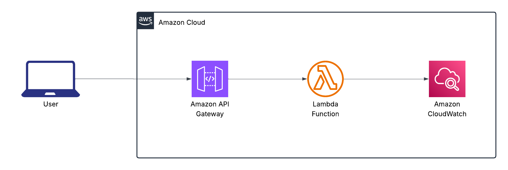

# AWS Lambda Circuit Breaker with Resilience4j & CloudWatch
A demonstration of the Circuit Breaker pattern running as a standalone Java AWS Lambda,fronted by Amazon API Gateway, using Resilience4j for fault-tolerance, Micrometer for metrics, CloudWatch for observability and alarms, and SNS for notifications when the circuit opens.

## Why Circuit Breaker?
* In distributed systems, a single downstream service outage (or slowdown) can cascade, tying up threads and connections across your architecture. The Circuit Breaker pattern:
* Fails fast when a service is unhealthy
* Prevents resource exhaustion by short-circuiting calls
* Automatically recovers after a configurable back-off
* Provides visibility into service health

## When to Use in Production
Use it whenever your Lambda (or any microservice) makes calls to an uncontrolled or variable-latency external endpoint for example:

* A third-party payment gateway
* An internal but low-SLA microservice
* A legacy SOAP/REST backend that may throttle you

By tripping the circuit after “too many” 5xx or timeouts, you avoid piling up concurrent requests, reduce tail-latency, and surface health issues via metrics and alerts.

## Architecture & Components



1. Amazon API Gateway (HTTP API)
2. AWS Lambda running com.mjones3.circuitbreaker.LambdaHandler
3. Resilience4j CircuitBreaker wraps a blocking Java 11 HttpClient call
4. Micrometer CloudWatchMeterRegistry streams CB metrics every minute
5. CloudWatch Alarm watches the resilience4j_circuitbreaker_state metric → trips when state = OPEN


In `LambdaHandler`:
 
    ```
    CircuitBreakerConfig config = CircuitBreakerConfig.custom()
    .failureRateThreshold(50)                     // >50% failures trips breaker
    .slidingWindowType(COUNT_BASED)               // count of calls
    .slidingWindowSize(10)                        // over last 10 calls
    .waitDurationInOpenState(Duration.ofSeconds(30)) // stay OPEN for 30s
    .build();

    CircuitBreakerRegistry registry = CircuitBreakerRegistry.of(config);
    CircuitBreaker cb = registry.circuitBreaker("externalApiCB");```

* CLOSED: all calls pass through.
* OPEN: all calls fail immediately (return 503).
* HALF_OPEN: after waitDurationInOpenState, allows a limited number of trial calls;
    * if they succeed, transitions back to CLOSED
    * if any fail, re-opens

## Metric Streaming & Alerts

* Metrics published via Micrometer’s CloudWatch registry every 1 minute under namespace `mjones3/CircuitBreakers`.
* Key metrics:
    * resilience4j_circuitbreaker_calls (count of calls)
    * resilience4j_circuitbreaker_failure_rate (percentage)
    * resilience4j_circuitbreaker_state (0=CLOSED, 1=OPEN, 2=HALF_OPEN)

A Terraform-created CloudWatch Alarm watches resilience4j_circuitbreaker_state for value 1 (OPEN) and sends an alert to the SNS topic circuit-breaker-alerts.

## Getting Started

* Java 11 SDK
* Maven 3.x
* Terraform > 1.2

## Build & Deploy

1. Clone & enter the repo root (where `deploy.sh` lives):

    ```bash
    git clone https://github.com/mjones3/circuit-breaker-aws.git
    cd circuit-breaker-aws
    chmod +x deploy.sh```

2. Deploy everything in one go:
    `./deploy.sh`

    This script will:
    * `mvn clean package` your Lambda JAR
    * `terraform init && terraform apply -auto-approve` to provision:
        * IAM Role + policies (including CloudWatch PutMetricData, SNS publish)
        * Lambda function (Java 11)
        * API Gateway HTTP API + integration
        * CloudWatch Alarm & SNS Topic

3. Note the script outputs the API endpoint outputs

## Invoke Test

* Healthy run (200):

    ```bash
    curl $(terraform output -raw api_endpoint)/```

* Simulate failure:

    ```bash
    # override to a 503 endpoint
    aws lambda update-function-configuration \
    --function-name circuitBreakerFunction \
    --environment Variables={EXTERNAL_API_URL=https://httpstat.us/500}

    # invoke repeatedly
    for i in {1..15}; do
    curl -s $(terraform output -raw api_endpoint)/ || echo
    done```

## Cleanup

To tear everything down when you’re done:

    ```bash
    cd terraform
    terraform destroy -auto-approve```


